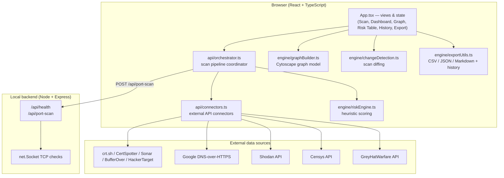
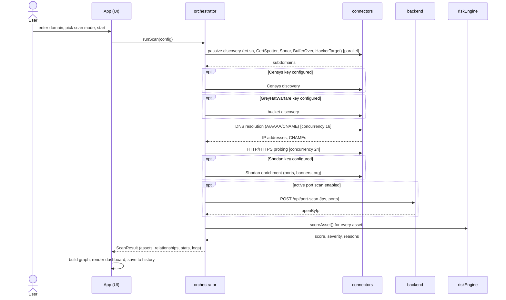
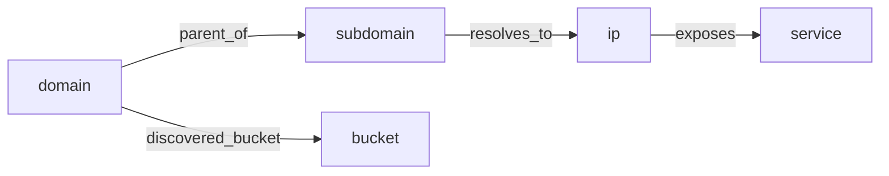
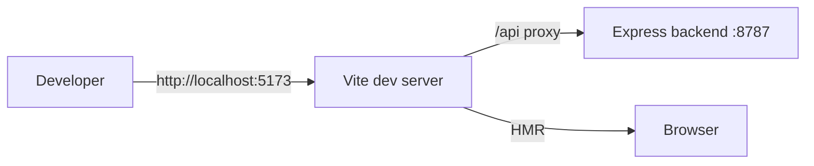
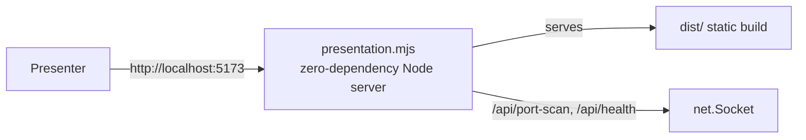

# EDAM — Architecture

This document describes the architecture of EDAM (External Discovery and Asset
Mapper): its components, the scan pipeline, the data model, and how it is
deployed. Diagrams use [Mermaid](https://mermaid.js.org/) and render directly on
GitHub and in most Markdown viewers.

## 1. Technology stack

| Layer | Technology | Purpose |
|-------|------------|---------|
| Frontend UI | React 18 + TypeScript | Views, state, workflow orchestration |
| Build / dev | Vite 6 | Dev server, HMR, production bundle |
| Styling | Tailwind CSS 4 | Utility-first styling |
| Visualization | Cytoscape.js | Interactive node-link asset graph |
| Icons | lucide-react | UI iconography |
| Backend | Node.js + Express | Active TCP port checks (`net.Socket`) |
| Presentation server | Node.js `http` (zero deps) | Serves the built app without `npm install` |
| Tests | Node.js built-in test runner | Unit tests for engine logic |

## 2. Component view

The browser does all discovery, scoring and rendering. The backend exists for a
single reason: browsers cannot open raw TCP sockets, so active port validation
is delegated to a small local service.

## 3. Scan pipeline (sequence)

## 4. Data model

Assets and relationships form a directed graph.

- **Asset types:** `domain`, `subdomain`, `ip`, `service`, `bucket`
- **Relationship types:** `parent_of`, `resolves_to`, `exposes`, `discovered_bucket`

Type definitions live in [`src/types/index.ts`](../src/types/index.ts).

## 5. Deployment views

### Development mode (`npm start`)

Vite serves the frontend with hot-module reload and proxies `/api/*` to the
Express backend on port 8787 (configured in `vite.config.ts`).

### Presentation mode (`npm run presentation`)

The presentation server serves the pre-built `dist/` folder and implements the
same two API endpoints, so the project runs on another machine with only
Node.js installed — no `npm install` required. Build `dist/` first with
`npm run build`.

## 6. Key design decisions

- **Browser-first architecture.** Maximizing what runs client-side keeps the
  backend tiny and the app portable. The backend's only job is the one thing the
  browser cannot do (raw TCP).
- **Pluggable connectors.** Each source is an independent function returning a
  normalized list; failures are isolated with `Promise.allSettled`, so one dead
  source never fails a scan.
- **Transparent, rule-based scoring.** Every risk score traces back to
  human-readable reasons and a recommended check (see `riskEngine.ts`), rather
  than an opaque model — important for an analyst-facing, explainable tool.
- **Two graph layouts for two questions.** The hierarchy map shows how a domain
  expands into names, IPs and services; the IP map anchors names and services
  around their host IP to expose shared infrastructure.
- **Separation of pure logic from UI.** Scoring, diffing, and graph building are
  framework-agnostic modules under `src/engine/`, which makes them unit-testable
  in isolation (see `test/`).
